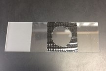

# Mounting the whole Retina

From Susan's protocol in the onedrive with some edits from Devon.

- **Materials:**
    - Slides with tape
    - Mounting media
    - Nail polish
    - Poly- D disc
    - 1 mL pipette (break the tip)

0. Prepare microscope slide, with pieces squares of duct tape at the center of the slide with a circular opening to eventually place the tissue that has been mounted on the round coverslip.  This duct tape is added to create the same thickness around the tissue.  Once the tissue is placed in that opening , and the coverslip to seal in the tissue is added, the tissue does not get smashed.
    - The duct tape is 1 inch or 2 ½ cm wide. 

    - Susan uses an open 15 ml conical tube to make a circular indent as guide, to make the cut-out with a razor blade

    

1. Pipette some mounting media* and take out bubbles.
2. Put a small drop (around 8 uL) in the slide. 
4. Put poly-D coverslip and gently tap it down. 
5. Put retina in with the pippete
6. Dry it using kim wipes and flatten it with forces (or wet kim wipe). 
7. Put mounting media (a lot!) on the side of the slide.
8. Use a 22x22 mm coverslip. with one edge, make contact with the bead of mounting media, slowly lowering the coverslip onto the tissue, letting the mounting pull the coverslip down.  The slower the square coverslip is lowered onto the tissue, the less chance there is for air bubbles to get caught.  
9. Gently tap on the square coverslip so that the mounting media goes out to all edges of the coverslip.

## Appendix: mounting media

We have two types: 
1. Fluoromount (Sigma #F4600), which dries hard and permanently adheres the square cover slip onto the slide.  This needs to dry for at least 2 days at room temp, prior to handling, long-term storage, or imaging.  Long-term storage is t 4 C.

2. SlowFade® Diamond Antifade Mountant (Invitrogen #S36972) – This does NOT dry hard and must be sealed with **nail polish**.  The advantages of using this mounting media is that it can be imaged as soon as the nail polish has cured AND it is possible to remove the coverslip with acetone, rinse the tissue and re-stain it if needed.

