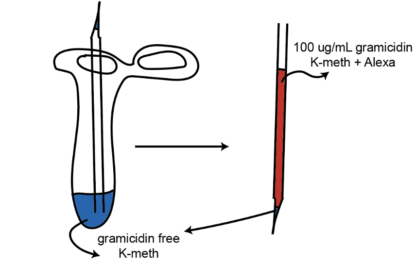

# Perforated Patch Clamp recording with gramicidin
Kudos to Trung who standarized the technique in the lab and wrote the protocol

Last update: 02/13/2024

## Internal Solution 

### Stock
- 1M Methansulfonate
- 1M KCl
- 1M HEPES (base) - pH to 7.2-7.3 with NaOH

### Working internal
- 125 mM K-Methansulfonate
- 10 mM KCl
- 10 mM Na-HEPES

pH again with KOH to 7.2-7.3, osmolality to 270 mOsm/kg, filter and keep in the fridge. Mix well/vortex before use.

In testing (Trung - 02/13/24), K-Methansulfonate, K-gluconate or KCl based internal solutions worked. Gramicidin in K-asp internals keeps precipitating for some reasons

## Gramicidin Stock (make new every day)

- Gramicidin powder (Sigma G5002) -> 4C fridge
- DMSO: the flammable cabinet under the fume hood. **If DMSO smells like garlic, it has degraded to sulfur-containing compounds and is no good to use**

### Making 20 mg/mL gramicidin stock:
Make the stock fresh every day.
- Take the gramicidin powder out of the fridge for it to warm up.
- Put an empty 1.5 mL microcentrifuge tube on the fine scale. Tare.
- Using the small green spatula, take a small dollop of gramicidin, put as much as you can in the microcentrifuge tube.
- Measure the amount of gramicidin (~ 0.5 - 1 mg).
- For each 1 mg => add 50 uL of DMSO. For example, if you measure out 0.3 mg of gramicidin, add 17 uL of DMSO.
- Briefly spin the tube down so all the powder and DMSO are at the bottom.
- Vortex for at least 5 minutes. Spin. Vortex again. Make sure all the powder dissolves.

The stock is only good within the same day.

### Working internal solution:
- Take 1 mL of the K-Methansulfonate to a new, clean microcentrifuge tube.
- Add 5 uL of the 20 mg/mL gramicidin stocks to 1 mL of internal for a final concentration of 100
ug/mL gramicidin. A final concentration of 50 - 200 ug/mL works well.
- The gramicidin stock will clump together. Don't pacnic.
- Vortex for 5 - 10 mins. Their should be no visible precipitate.
- Mix with Alexa dyes if required.
- Take the internal into 1 mL syringe. **DO NOT USE THE SYRINGE FILTER WITH THIS SOLUTION.**

Keep the internal on ice / cold and out of bright light when not in use. If the internal has visible clumps after vortexing, try titrurate it through a 26G needle for about 10 times

## Filling Electrodes

- Take a new 0.6 or 1.5 mL microcentrifugre tube (I like the 0.6 but it doesn't matter).
- Add ~ 100 - 200 uL of the K-methansulfonate WITHOUT gramicidin internal solution in the tube.
- Flip the back of the electrode down into the solution for back fill (See figure)

   

- Back fill for about 30s - 1 minute (until you can see a very tiny amount of internal in the front of
the tip).
- Take the electrode out. Dry the outer part (to minimize noise). Remember to close the tube.
- Fill the rest of the electrode with gramicidin-containing internal.
## Perforated Patch
- Apply pressure (~ 1 unit on the meter) before dipping the electrode in the bath.
- Turn the seal test on ( Seal and Leak  in Symphony or  Seal Test  in Multiclamp). Offset the
pipette LJP (will be ~40 -50 mV).
- Move the electrode down to the cell AS QUICK AS POSSIBLE. Stop when you see the dimple and
/ or a slight decrease in the seal test.
- Remove the pressure and apply negative pressure immediately.

        K-methansulfonate takes a bit more time /negative pressure to form the seal than K-asp or K- gluconate. Sometimes it's not gonna be immediately flat like sealing with K-asp. Don't freak out. Keep applying gentle negative pressure and move the holding voltage towards -50 - -60 mV ( Leak  mode  in Symphony or  Holding  in MultiClamp). The seal will get better with time (if sealed correctly).

- Note the time when the response to Seal test is flat and centers around 0pA (Gigaseal formed).
Compensate for fast Capacitance (Cf).
- The capacitance will show up slowly when the cell gets perforated, then the peak of the
Capacitance slowly grows.
- **Quick hack + sanity check:** move between Vclamp and I=0 to see the peak of the action potential and resting membrane potential. The peak of the AP will slowly be higher and higher. If
your resting membrane potential at a gigaseal is really off (10-20mV), something is wrong and it
is better to retract the electrode and try again than wait for forever.
- Hit Auto in **Whole cell Compensation** if you are happy with the perforation. I get good recordings with Series resistance of < 30 MOhm after 15 - 20 minutes, at 32 degrees C. Note down the
access resistance.
- Compensate for slow Capacitance (Cs). Move to I=0 or IC for current clamp.
- Remember to set the recording mode on Symphony into Perforated_Grami .

If the Capacitance grows really fast, especially at the beginning => probably the cell gets ruptured.
Check if Alexa has filled the cell or not.

## Trouble shooting
### I can't make gigaseal?
- The backfill of gramicidin-free at the tip was not enough.
- Took to long to move the pipette down => gramicidin reaches the tip of the pipette
- Mercury is in retrograde
### I can see dirts in the pipettes?
- Gramicidin starts to precipitate => make new internal / stock.
- Vortex more at the beginning.
- Keep the syringe on ice to slow the precipitation down.
### Cells get partially perforated, AP doesn't peak more than 0mV?
- Backfill to much
- Not waited long enough
- DMSO was weird => buy new DMSO.
- Gramicidin stock was bad
- Concentration of Gramicidin was low
- There was a bubble at the interface of the gramicidin-free and gramicidin internals
- ...
### Cells keep dying
- Make sure to use ATP-free internals
- Make sure the osmolality is correct
- Make sure it's not K-Aspartate base internal.
Good luck!